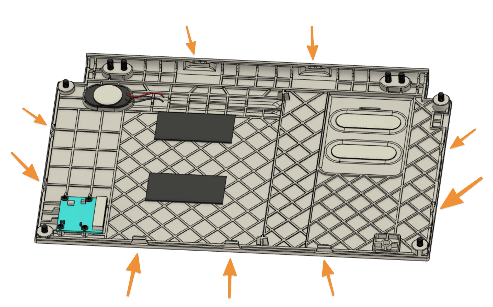
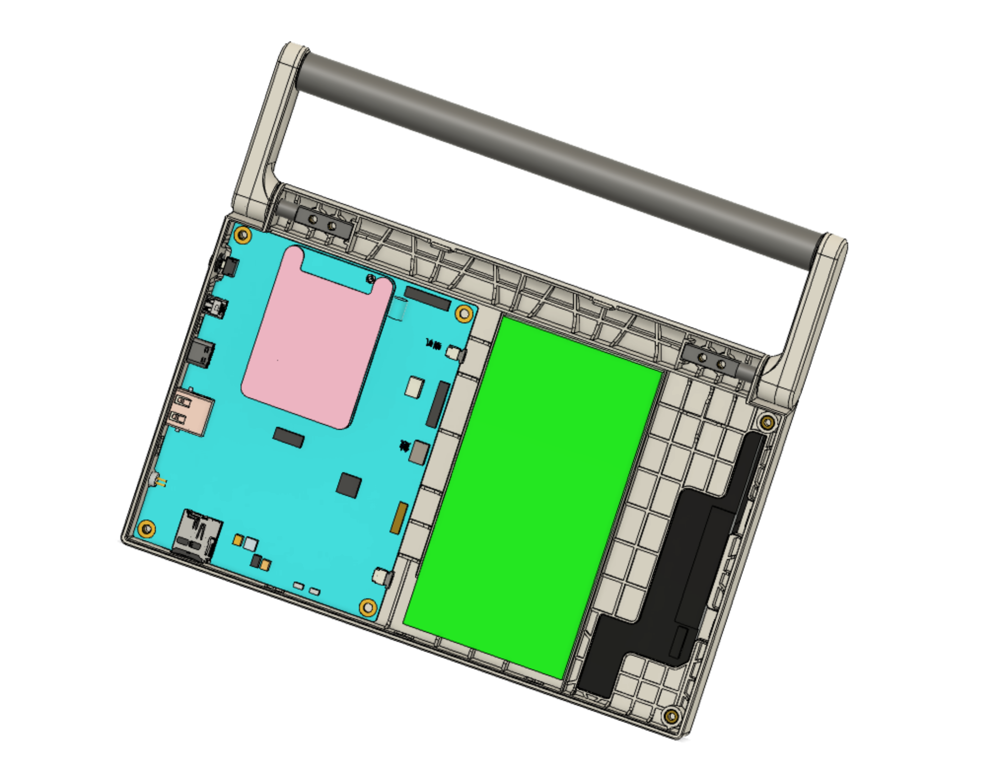

## Hardware Maintenance Guide

**Note: Before continue, you must know what you are doing!**

We expect and even encourage you to experiment with the software and hardware of CutiePi. With that said, please keep in mind that the device is under standard warranty. This means breaking components during disassembly will void your warranty.

Please use this guide at your own risk. 

### FCC Compliance 

This device complies with part 15 of the FCC Rules. Operation is subject to the condition that this device does not cause harmful interference (1) this device may not cause harmful interference, and (2) this device must accept any interference received, including interference that may cause undesired operation. Any changes or modifications not expressly approved by the party responsible for compliance could void the user's authority to operate the equipment.

### Tools needed 

- Screwdriver for M3 Phillips Screws 
- Patience and steady hands

### Steps 

1. Turn the device off, and remove the micro SD card 
2. Unscrew the four M3x8 screws (holding the hinge) on the top 
3. Unscrew the four M3x6 screws on the corners, and place them aside

    

4. Put your fingernail or a card in the seam between the back cover and the case on the top, carefully release the snaps around the four edges of device, there are 9 of them: 

    
    

5. Gently lift up the back cover, **DO NOT REMOVE IT YET**! As two cables are connected from the cover to the board, the L-shape camera cable is short and would break if you lift it up too high.

    

6. Here we disconnect the two cables' connectors before removing the back cover 

    
    
    
7. Done! 

    

### What now? 

- This is a good time to swap the Compute Module 4, the battery (requires desoldering), or the camera module 
- You can flash or tweak the [firmware for CutiePi board](https://github.com/cutiepi-io/cutiepi-firmware), with a ST-Link V2 flasher and a PH1.0 4p cable
- In case you want to 3D print or modify your enclosure, please checkout CAD drawing and 3D printable STL models in the [enclosure design](https://github.com/cutiepi-io/cutiepi-enclosure) repo 

    

- For schematic, BOM, and gerber files, please find it in the [cutiepi-board](https://github.com/cutiepi-io/cutiepi-board) repo 
