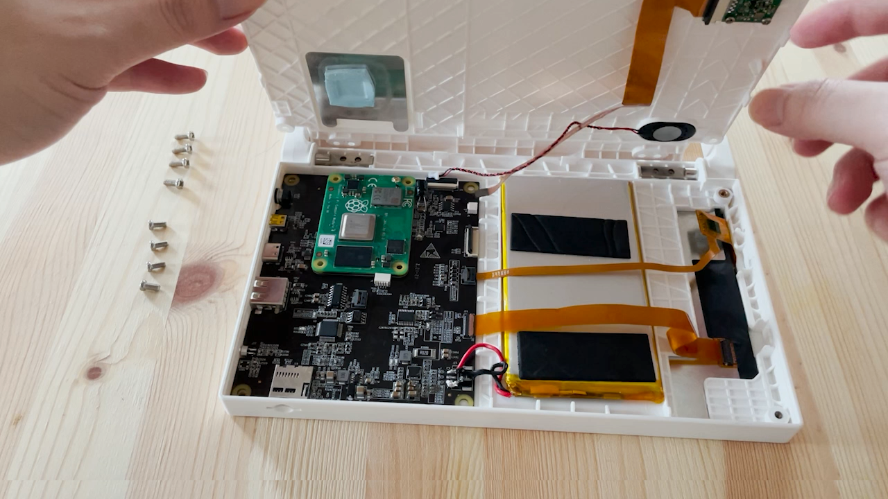

## Hardware Maintenance Guide

**Note: Before continue, you must know what you are doing. **

Please understand that we can not provide any warranty or guarantee the hardware will still function properly after the following steps. 

Please use this guide at your own risk. 

### Tool needed 

- Phillips-Head screwdriver

### Steps 

1. Turn the device off, and remove the micro SD card 
2. Remove the four M3x8 screws (holding the hinge) on the top 
3. Remove the four M3x6 screws on the corners, and place them aside

    

4. Put your fingernail or a card in the seam between the back cover and the case on the top, carefully release the snaps around the four edges of device

    

5. Gently lift up the back cover, **DO NOT REMOVE IT YET**

    

6. Disconnect two connectors (for the speaker and camera) before removing the back cover 

    
    
    
7. Done. You may find CutiePi tablet's CAD drawing and 3D printable STL models in the [enclosure design repo](https://github.com/cutiepi-io/cutiepi-enclosure).

    
