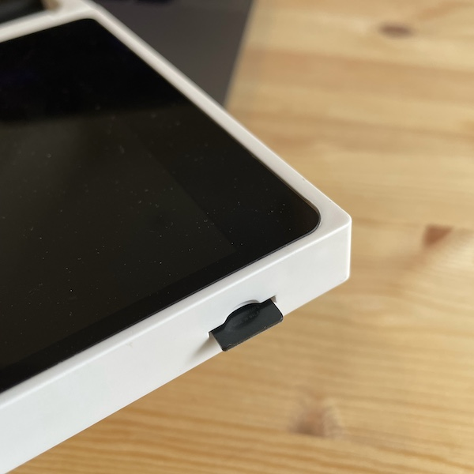

## Quick Start Guide 

- Name: CutiePi tablet
- Model: CUTIEPI-01 
- FCC ID: 2A3SP-CUTIEPI-01

### Turning CutiePi On / Off

- Power On: Press and hold for 3s 
- Sleep/Wake: Short press
- Force Shutdown: Press and hold for 10s 

Please make sure the display is completely turned off after it was shutting down, otherwise it may drain the battery. 

### Mind the Heat 

Do not be alarmed if the back of the CutiePi gets hot: 

- This is by design. This means that the heat sink is doing its job 
- If you wish, you may cool down CutiePi by by adjusting the `Power Mode` in the Settings

### In Case of Software Upgrade 

Just like Raspberry Pi, the CutiePi's OS runs on a micro SD card: 

- The SD card slot is located in the lower right corner of the device 
- It is spring loaded, and can be released with a gentle push 
- Insert the card face down 

You can find more information in [System Flashing](SystemFlashingGuide.md) and [Hardware Maintenance](HardwareMaintenanceGuide.md) guides. 

### Compliance 

This device complies with part 15 of the FCC Rules. Operation is subject to the condition that this device does not cause harmful interference (1) this device may not cause harmful interference, and (2) this device must accept any interference received, including interference that may cause undesired operation. Any changes or modifications not expressly approved by the party responsible for compliance could void the user's authority to operate the equipment.
