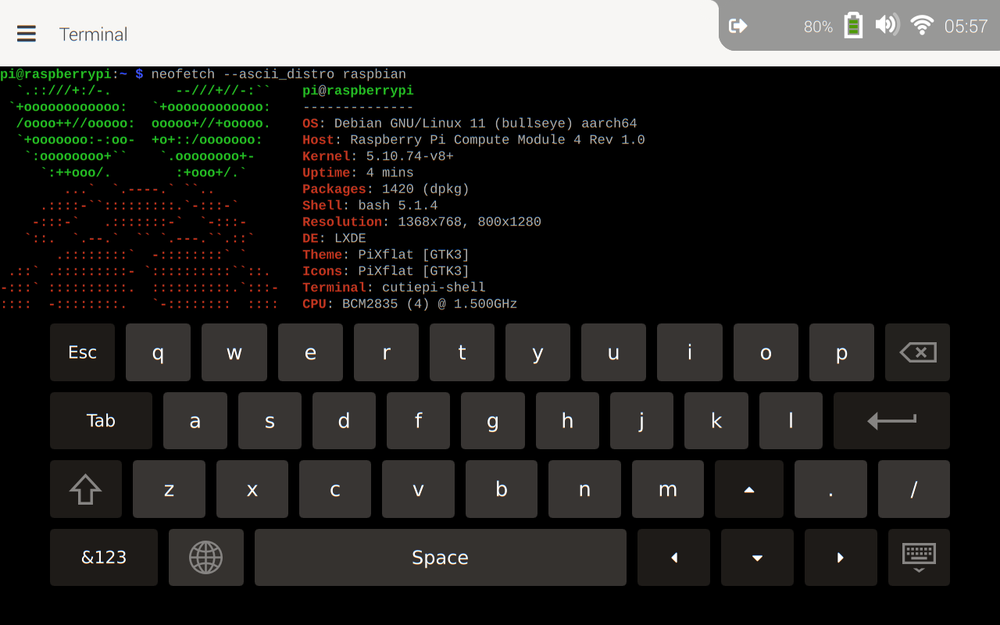

## CutiePi tablet - User Manual

- Name: CutiePi tablet
- Model: `CUTIEPI-01`
- FCC ID: `2A3SP-CUTIEPI-01`

## Introduction

CutiePi is a Raspberry Pi 4 based tablet powered by the Compute Module 4. It has a 5000mAh li-po battery, an 8 inch multi-touch display with 1280 x 800 resolution, and a handle that also doubles as a stand.

The tablet also has a built-in gyroscope, a rear-view camera, a microphone and a speaker, you can simply carry or use it like your everyday gadgets.

## How to Get Started with your CutiePi

### Turning CutiePi On / Off

- Power On: Press and hold for 3s 
- Sleep/Wake: Short press
- Force Shutdown: Press and hold for 10s 

Please make sure the display is completely turned off after it was shutting down, otherwise it may drain the battery. 

### Mind the Heat 

Do not be alarmed if the back of the CutiePi gets hot: 

- This is by design. This means that the heat sink is doing its job 
- If you wish, you may cool down CutiePi by by adjusting the `Power Mode` in the Settings

### In Case of Software Upgrade 

Just like Raspberry Pi, the CutiePi's OS runs on a micro SD card: 

- The SD card slot is located in the lower right corner of the device 
- It is spring loaded, and can be released with a gentle push 
- Insert the card face down 

You can find more information in [System Flashing](SystemFlashingGuide.md) guide.

## CutiePi shell - the user interface 

CutiePi shell, our mobile UI powered by the open source Qt framework, turns Raspberry Pi OS into a functional tablet UX while maintaining compatibility.
It has most basic functions covered, from typing a command in terminal, connecting to a WiFi hotspot, to logging into web.

### Features 

- Lockscreen with sleep/wake button events handling
- Web browser, terminal emulator, and on-screen keyboard
- Built-in adblocker, using ABP-compatible filters
- Side-tab for multitasking
- WiFi configurator
- Battery charging status and level reading 
- Orientation sensor support (accelerometer and gyroscope)

| Screenshot | Description |
| ------------- | ------------- |
|  | Lockscreen, swipe from bottom to top to unlock the screen. You can change the wallpaper in Settings. | 
|  | Show the system status by tapping at the upper right corner, you can control the audio volume, orientation lock, system brightness and wifi here.| 
|  | Tap on any input field in the shell will bring up the virtual keyboard. Tap on the "🌐" icon at the bottom left will bring up the language selector.|
|  | Typing in the URL bar will bring up the history view. | 
|  | Tap on the upper left corner "☰" icon will open the side tabs view. You can open/close tab or switch to different tabs here. |
|  | Long press on "➕ New Tab" will open up a terminal emulator tab. A termanl layout keyboard will show up accordingly. | 
|  | The Settings view gives you more controls over the system, for example airplane mode, timezone, and power mode. | 
|  |  You can click on the "Switch to Desktop now" button to toggle shell or desktop UI. |
|  |  Press and hold the power button for 6 seconds to bring up this power off view.  |

## Cautions  

We expect and even encourage you to experiment with the software and hardware. With that said, please keep in mind that the device is under standard warranty. This means breaking components during disassembly will void your warranty.

Please refer to the [Hardware Maintenance](HardwareMaintenanceGuide.md) guide for more information.

### Compliance 

This device complies with part 15 of the FCC Rules. Operation is subject to the condition that this device does not cause harmful interference (1) this device may not cause harmful interference, and (2) this device must accept any interference received, including interference that may cause undesired operation. Any changes or modifications not expressly approved by the party responsible for compliance could void the user's authority to operate the equipment.

## Support 

For any suggestions or software related questions, please join the community chat: [https://t.me/cutiepi_io](https://t.me/cutiepi_io) 
For any non-software related questions please mail to [hello@cutiepi.io](mailto:hello@cutiepi.io) 

Happy Hacking!
