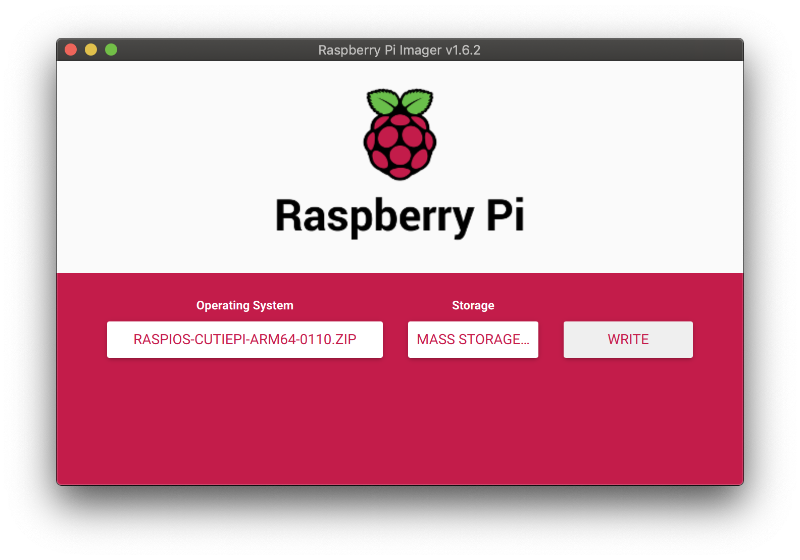

## System Flashing Guide 

### Download the latest image 

Latest system image for CutiePi tablet (`2022-01-10`):

- [Raspberry Pi OS arm64 bullseye + CutiePi shell](https://github.com/cutiepi-io/pi-gen_stage4.5-cutiepi/releases/tag/2022-01-10)

        File: raspios-cutiepi-arm64-0110.zip (1.2G)
        SHA1: 6c37febd7f63e584734f67cdd56830bc4c669537

### Download the image writer

We recommend using Pi Imager or Etcher: 

- [Raspberry Pi Imager](https://www.raspberrypi.com/software/)
- [Etcher](https://www.balena.io/etcher/)

### Flash the micro SD card 

Select `CHOOSE OS`, `Use custom`, and click `WRITE`. 

When it's done, insert the card back to CutiePi tablet with the card facing down.